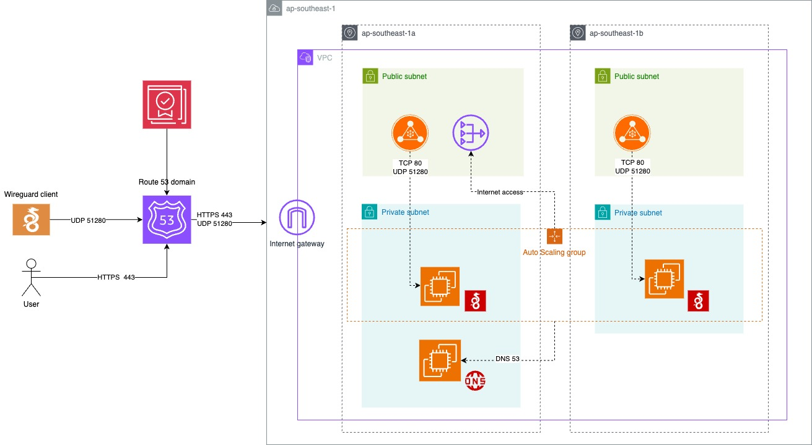

# WireGuard VPN Infrastructure on AWS (CDK)

This project provisions a secure, scalable WireGuard VPN server infrastructure on AWS using AWS CDK (TypeScript). It includes:

- **WireGuard VPN server**: Deployed in a private subnet, accessible via a Network Load Balancer (NLB) and protected by security groups.
- **Malware Protection DNS**: Optional DNS server that filters traffic for malware domains, integrated with the VPN for enhanced security.
- **Automated Subdomain Management**: Creates and manages subdomains and DNS records for VPN endpoints.

## Architecture Diagram



## Main Components

### 1. VPN Stack (`SnakeVpnStack`)
- Provisions a WireGuard VPN server in a private subnet.
- Exposes the VPN via an AWS Network Load Balancer (NLB).
- Integrates with Route53 to create DNS records for the VPN endpoint.
- Optionally uses a custom DNS server for malware protection.

### 2. Malware Protection Stack (`SnakeMalwareProtectionStack`)
- Deploys a DNS server that filters out known malware domains.
- Whitelist domains can be managed via AWS SSM Parameter Store.
- The DNS server's private IP is exported for use by the VPN stack.

### 3. Subdomain Stack (`SnakeSubdomainStack`)
- Automates creation of subdomains and hosted zones for different environments (e.g., dev, prod).
- Exports hosted zone IDs and domain names for cross-stack usage.

## WireGuard Setup Script

The `scripts/wireguard-setup.sh` script configures the WireGuard server, generates client/server keys, sets up the VPN, and integrates with the malware protection DNS if enabled. It also provides a QR code for easy mobile client configuration.

## Deployment

### Deploy to AWS via GitHub Actions

This project uses a GitHub Actions workflow for automated deployment to AWS. You can trigger the deployment manually from the GitHub Actions tab using the **Deploy CDK Stack** workflow.

**To deploy:**
1. Go to the **Actions** tab in your GitHub repository.
2. Select the **Deploy CDK Stack** workflow.
3. Click **Run workflow** and provide:
   - The branch to deploy (e.g., `main`)
   - The environment (`dev` or `prod`)

The workflow will handle installing dependencies, configuring AWS credentials, and running the CDK deployment with the appropriate parameters and secrets.

## Usage

1. **Install dependencies:**
   ```bash
   npm install
   ```
2. **Build the project:**
   ```bash
   npm run build
   ```
3. **Deploy to AWS:**
   - For development:
     ```bash
     npx cdk deploy -c config=dev --all --debug
     ```
   - For production:
     ```bash
     npx cdk deploy -c config=prod --all
     ```

## Useful Commands

- `npm run build`   compile typescript to js
- `npm run watch`   watch for changes and compile
- `npm run test`    perform the jest unit tests
- `npx cdk deploy`  deploy this stack to your default AWS account/region
- `npx cdk diff`    compare deployed stack with current state
- `npx cdk synth`   emits the synthesized CloudFormation template

---

For more details, see the source code and comments in each stack and script file.
